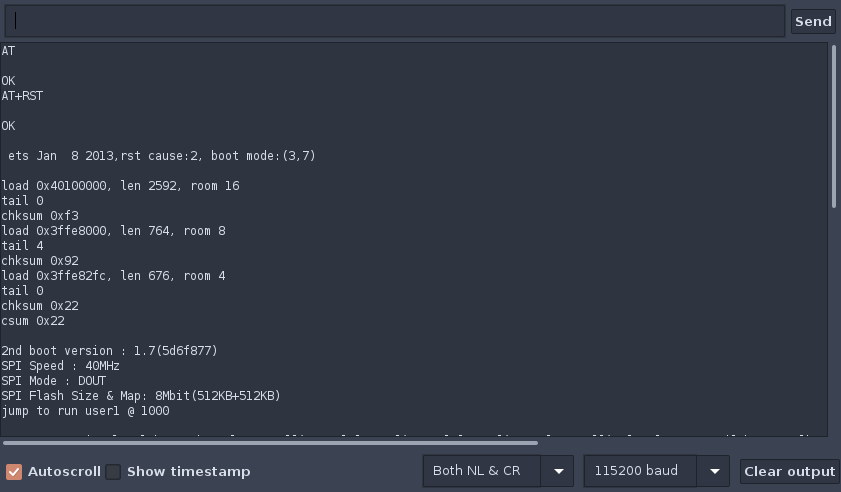
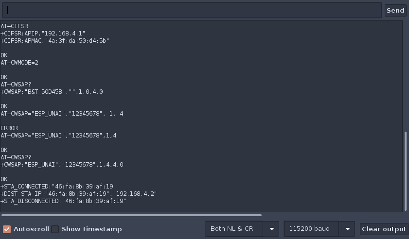

# WIFI MODULUA

Proiekturako erabiliko den wifi modulua, **ESP8266** izango da. Arduino komunitatean zehar zabalduena da eta honi buruz dokumentazio asko aurkitu daiteke. Bere funtzionamendua simplea da, mikrokontrolagailuaren eta moduluaren arteko komunikazioa UART bidez izango da eta *AT* komandoak erabiliz konfiguratu daiteke. 

## Modulua probatzen

Modulua automatikoki konfiguratuko duen programa idazten hasi aurretik, moduluaren funtzionamendua eta oinarrizko *AT* komando batzuk aztertuko dira. Hau burutzeko modulua arduinora konektatuko da *UART* bidez kontrolatu ahal izateko.

##### Konexioak

Honako hauek dira egin beharreko konexioak.

|ESP8266|Arduino UNO|
|-------|-----------|
|TX	|TX	    |
|RX	|RX	    |
|EN	|3.3v	    |
|3V3	|3.3v	    |
|GND	|GND	    |

##### Probak

Probak egiteko **Arduino IDE** editorea instalatuko dugu, programa honetaz baliatuta, kodea mikroan kargatu ahal izango dugu probak egiteko. Programa instalatzeko honako komando hau erabil daiteke

    sudo apt install arduino

Kasu honetan, aplikazioa irekitzerakoan defektuz ateratzen den programa hutsa arduinoan instalatuko dugu eta *Serial Monitor* erreminta irekiko dugu. Tresna horren bidez, lehen komentatutako *AT* komandoak bidaliko ditugu wifi modulura.

Arduinoaren kasuan, *UART* bat dauka bakarrik. Honen ondorioz ezin izango dira *Serial Monitor* tresnaren bitartez mikroak eta moduluak trukatzen dituzten mezuak. Hori posible izateko *UART* bat baino gehiago behar dira, **Arduino MEGA** plakan bezala. 

## AT komandoak

