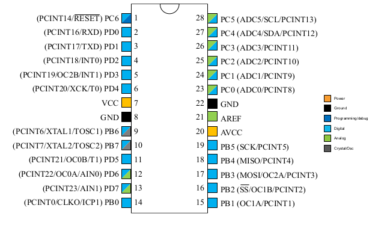

# ATMEGA328P SPECS

## Atmega328p mikrokontroladorearen bloke diagrama

## Atmega328p mikrokontroladorearen hankatxoak

## Pinen deskribapena eta konexioak Atmega328p mikrokontroladorean

#### PORTB

|Pin zenb.| Pin izena| Deskribapena| Funtzioa | Erabilera |
|---------|----------|-------------|----------| --------- |
|14	  | PB0(ICP1/CLK0) | PORTB-ko 0 pina | ICP1(Timer/Counter1 Input Capture Pin), CLK0(Divided System Clock) |
|15	  | PB1(OC1A) | PORTB-ko 1 pina | OC1A (Timer/Counter1 Output Compare Match A Output) |
|16	  | PB2(SS/OC1B) | PORTB-ko 2 pina | SS (SPI Slave Select Input). Pin hau "LOW" dago esklabu moduan dagoenean. OC1B (Timer/Counter1 Output Compare Match B Output) |
|17	  | PB3(MOSI/OC2A) | PORTB-ko 3 pina | MOSI (Master Output Slave Input). kontroladorea esklabu moduan dagoenean datuak pin honetan jasotzen dira. [SPI] OC2 (Timer/Counter2 Output Compare Match Output) |
|18	  | PB4(MISO) | PORTB-ko 4 pina | MISO (Master Input Slave Output). kontroladorea esklabu moduan dagoenean pin honetatik bidaltzen dira datuak.[SPI] |
|19	  | PB5(SCK) | PORTB-ko 5 pina | SCK (SPI Bus Serial Clock). kontroladorea eta beste gailuek komunikazio zehatza izan dezaten erloju seinalea. [SPI]|
|9	  | PB6(XTAL1/TOSC1) | PORTB-ko 6 pina | XTAL1 (Chip Clock Oscillator pin 1 or External clock input), TOSC1 (Timer Oscillator pin 1)
|10	  | PB7(XTAL2/TOSC2) | PORTB-ko 7 pina | XTAL2 (Chip Clock Oscillator pin 2), TOSC2 (Timer Oscillator pin 2)

#### PORTC
|Pin zenb.| Pin izena| Deskribapena| Funtzioa | Erabilera |
|---------|----------|-------------|----------| --------- |
|23	  | PC0(ADC0) | PORTC-ko 0 pina | ADC0 (ADC Input Channel 0)
|24	  | PC1(ADC1) |PORTC-ko 1 pina | ADC1 (ADC Input Channel 1)
|25	  | PC2(ADC2) |PORTC-ko 2 pina | ADC2 (ADC Input Channel 2)
|26	  | PC3(ADC3) |PORTC-ko 3 pina | ADC3 (ADC Input Channel 3)
|27	  | PC4(ADC4/SDA) |PORTC-ko 4 pina | ADC4 (ADC Input Channel 4), SDA (Two-wire Serial Bus Data Input/output Line)
|28	  | PC5(ADC5/SCL) |PORTC-ko 5 pina | ADC5 (ADC Input Channel 5), SCL (Two-wire Serial Bus Clock Line)
|1	  | PC6(RESET) |PORTC-ko 6 pina | Defektuz pin hau RESET pin moduan erabiltzen da. PC& I/O pin bat bezala erabili ahal izango da, RSTDISBL programatzen denean.

#### PORTD
|Pin zenb.| Pin izena| Deskribapena| Funtzioa | Erabilera |
|---------|----------|-------------|----------| --------- |
|2	  | PD0(RXD) | PORTD-ko 0 pina |RXD (Data Input Pin for USART), USART Serial Communication Interface
|3	  | PD1(TXD) | PORTD-ko 1 pina |TXD (Data Output Pin for USART), USART Serial Communication Interface, INT2( External Interrupt 2 Input)
|4	  | PD2(INT0) | PORTD-ko 2 pina |External Interrupt source 0
|5	  | PD3(INT1/OC2B) | PORTD-ko 3 pina |External Interrupt source1, OC2B(PWM - Timer/Counter2 Output Compare Match B Output)
|6	  | PD4(XCK/T0) | PORTD-ko 4 pina |T0( Timer0 External Counter Input) XCK ( USART External Clock I/O)
|11	  | PD5(T1/OC0B) | PORTD-ko 5 pina |T1(Timer1 External Counter Input), OC0B(PWM - Timer/Counter0 Output Compare Match B Output)
|12	  | PD6(AIN0/OC0A) | PORTD-ko 6 pina |AIN0(Analog Comparator Positive I/P), OC0A(PWM - Timer/Counter0 Output Compare Match A Output)
|13	  | PD7(AIN1) | PORTD-ko 7 pina |AIN1(Analog Comparator Negative I/P)

## Atmega328p mikrokontroladorearen ezaugarriak

* **CPU:** 8-bit AVR
* **Pin kopurua:** 28
* **Operazio tentsioa:** +1.8V-tik +5.5V-ra
* **Komunikazio interfazea:** 
    - Master/Slave SPI, (17, 18 eta 19 pinak) erabili daitezke kontroladorea programatzeko.
    - USART (2 eta 3 pinak erabili daitezke programatzeko)
    - Two-wire interfaze seriala (27 eta 28 pinak erabilita, serboak bezalako periferikoak konektatzeko erabiltzen dira)
* **ADC modulua:** 6 kanal, 10 biteko resoluzioa
* **Timerrak:** 2 8 biteko kontagailuak preskalerrarekin eta 16 biteko kontagailu bat.
* **Konparagailu analogikoa:**1 (12, 13 pinak)
* **PWM kanalak:** 6 
* **kanpo-osziladoreak:** 
    - 0-4MHz @ 1.8V to 5.5V
    - 0-10MHz @ 2.7V to 5.5V
    - 0-20MHz @ 4.5V to 5.5V
* **Barne osziladorea:** 8MHz
* **Programa memoria mota:** Flash
* **Program memory/Flash memory:** 32Kbytes[10000 write/erase cycles]
* **CPU abiadura:** 1MIPS for 1MHz
* **RAM:** 2Kbytes Internal SRAM
* **EEPROM:** 1Kbytes EEPROM
* **Watchdog Timer:** Programmable Watchdog Timer with Separate On-chipOscillator
* **Program Lock:** Bai
* **Energia aurrezteko moduak:** Idle, ADC Noise Reduction, Power-save, Power-down, Standby and Extended Standby
* **Operazio Tenperatura:** -40°C to +105°C
