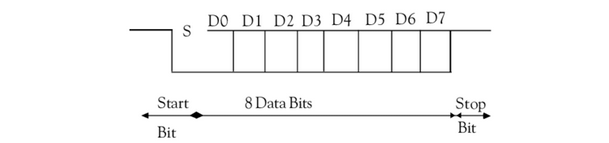
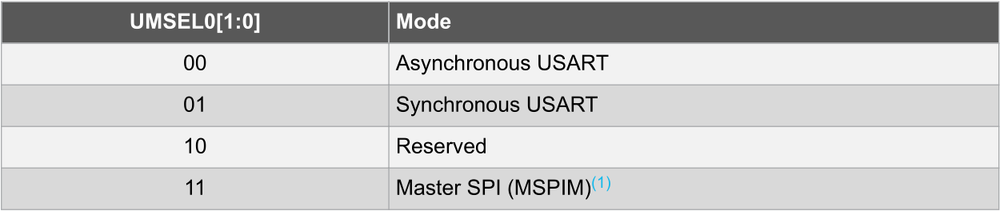
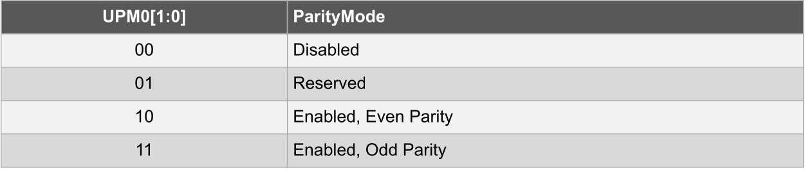
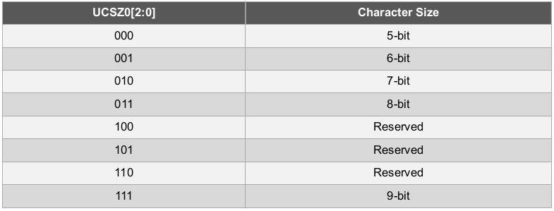
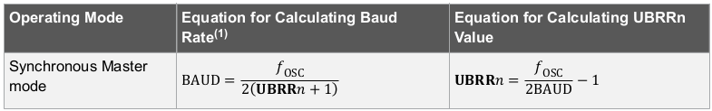
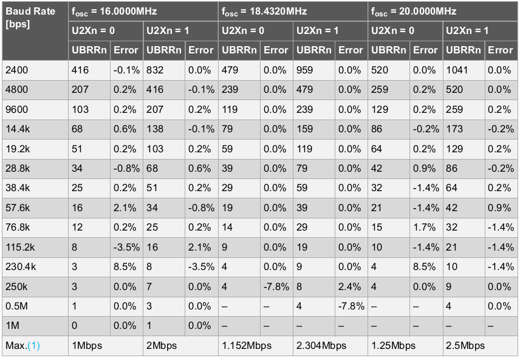

# KOMUNIKAZIO SERIALA AVR-n (USART)

USART, ingelesezko *Universal Syncronous Asynchronous Receiver-Transmitter* sigletatik dator. Mikrokontrolagailua, ordenagailuarekin komunikatzeko balioko du. 

##### Komunikazioaren azalpena

USART bidezko komunikazioa simplea da azaltzen, komunikazioa hasteko start bita erabiliko da, hau da beheranzko aldaketa bat detektatzen denean seinalean, UART-ek interpretatu egingo du, hurrengo bitak datuak direla. Azkenik stop bitaren bidez, mezua bukatu dela adieraziko da. Stop bita, 1-eko konstantea izango da. Ondorengo irudian ikusi daiteke aurretik azaldutakoa.

AVR mikrokontrolagailu batekin komunikazio seriala gauzatzeko erabiliko diren kodearen eta programen azalpen hau bi ataletan banatuko da.

* AVR-n konfigurazioa
* Screen serie terminalaren instalazioa eta oinarrizko erabilera

## AVR-n konfigurazioa

Konfigurazioarekin hasteko, erregistroak behar diren bezala hasieratu beharko ditugu, mikrokontrolagailuak izatea nahi dugun portaera lortzeko.

##### DATU TRANSMISIOA ETA DATU JASOKETA GAITU
Bit hauek UCSR0B erregistroaren barruan daude, eta datu transmisioa(TX) edo jasoketa(RX) gaitzeko ahalmena daukate, bitak 1 balioa daukatenean.
Biten balioa 1-era jartzeko honako hau izango da kodea:

    UCSR0B |= (1 << TXEN0);
    UCSR0B |= (1 << RXEN0);

##### USART OPERAZIO MODUA AUKERATU
Atmega328p mikrokontrolagailuak hainbat	operazio modu desberdinetan funtzionatzeko konfigura daiteke, ondoko taulan ikus daitekeen bezala

Irudian antzematen den moduan, *UCSR0C* erregistroko *UMSEL0[1:0]* bitei balio desberdinak emanda aukeratuko dugu operazio modua. Gure kasuan asinkronoa erabiliko dugu, beraz *UMSEL01* = 0 eta *UMSEL00* = 0 izan beharko dute.

    UCSR0C &=~ (1 << UMSEL00); 
    UCSR0C &=~ (1 << UMSEL01);
   
##### PARITATEA
Datuak elkartrukatzerakoan erroreak detektatzeko, paritate bitak erabiltzen dira.

Ikus daitekeen bezala, bi paritate mota daude, bakoitia eta bikoitia. Gure kasuan ez dugu erabiliko, beraz *UPM01* = 0 eta *UPM00* = 0 izan beharko dute.

    UCSR0C &=~ (1 << UPM00);
    UCSR0C &=~ (1 << UPM01);
   
##### STOP BITA KONFIGURATU
Hasieran aipatu den bezala, transmisio bakoitza noiz hasten den eta bukatzen den jakiteko *start* eta *stop* bitak erabiltzen dira. *Stop* bitaren kasuan bita bat edo bi izan daitezke. Luzeera hori *USBS0* bitean balioak aldatuz zehaztuko da. Gure kasuan bateko luzeera jarriko diogu, beraz *USBS0* = 0 izan beharko da. 

    UCSR0C &=~ (1 << USBS0);

##### DATUAK IZANGO DUEN BIT KOPURUA ZEHAZTU

Datuak izango duen bit kopurua zehazteko *UCSR0C* eta *UCSR0B* erregistroetako *UCSZ0[2:0]* bitei balio desberdinak emango zaizkie, nahi den luzeeraz lortzeko. Ondorengo taulan bit hauen balioak eta bakoitzari dagokion bit kopurua agertzen dira.

Gure kasuan datuak 8 bit izango ditu, horretarako *UCSZ0[2:0]* biten balioak 011 izan behar dute hurrenez hurren 

    UCSR0C |= (1 << UCSZ00);
    UCSR0C |= (1 << UCSZ01);
    UCSR0B &=~ (1 << UCSZ02);	//kasu honetan behar den azkeneko 
				//bita UCSR0B erregistroan dago kokatuta.

##### BAUDRATE

Baud rate, komunikazio kanal batetik transmititzen diren datuen maiztasuna zehazten du. Atmega328p mikrokontrolagailuan *UBRR0* erregistroan balio bat zehaztu behar da nahi den *baud rate*-aren arabera. Balio hori kalkulatzeko ondorengo formula erabiliko da.

Gure kasuan 9600-ko *baud rate*-a nahi dugu, beraz hau izango litzateke *UBRR0*-n jarri beharko genukeen balioa:

$$ UBRR0 = \frac{16000000}{8 * 9600}-1 = 207,3$$

Taulan ikusten den bezala lortutako emaitza, taulan 3 lerroan eta 4 zutabean dagoen balioa da.
Gure formulan ikusten den bezala *baud rate*-a gordetzeko erabiltzen diren 16 bitak erabili beharrean zati 8 egiten da. Hori *U2X0* bita 1 balioa daukalako da. Bit hori modu asinkronoan erabiltzen da eta baud ratearen zatitzailean 16 tik 8 ra pasatzen du, transmisio maiztasuna bikoiztuz.

Honako hau izango litzateke beharrezko kodea, 207 balioa zuzenean jarriz: 
    
    UCSR0A |= (1 << U2X0);
    UBRR0 = 207;

Zenbakia zuzenean jarri nahi bada, formula jarri dezakegu:

==KONTUZ: formulako biderketa jartzen badugu overflow gertetuko da, biderketako emaitza adierazteko ez dago bit nahikoa. Hori ekiditeko, zatiketak erabiliz egingo da kalkulua.==

    #define F_CPU 16000000
    #define BAUD 9600

    UCSR0A |= (1 << U2X0);
    UBRR0 = (F_CPU/16/BAUD)-1;

##### ASCII balioak C-n

**C** lengoaian karaktere baten ascii kodea lortzea nahiko erraza da, honako hau izango litzateke zenbaki baten ascii kodea lortzeko kodea:

    zenb = '0' + 3;
    printf("%d\n", zenb);   //honek ascii kodearen zenbakia 
			    //pantailaratuko du
    printf("%c\n", zenb);   //honek ascii kodeari dagokion 
			    //karakterea pantailaratuko du

## Screen serie terminalaren instalazioa eta oinarrizko erabilera

*Screen*, terminal multiplexore bat da. Window manager baten antzekoa, baina sesio desberdinak terminalean irekitzen utziko digu. Gure kasuan Komunikazio serialean trukatzen diren mezuak pantailaratzeko erabiliko dugu.

#### Instalazioa banaketa desberdinetan

Programa honen instalazioa oso simplean da, programa linuxeko banaketa gehienetako errepositorioetan baitago.

Arch-en oinarritutako banaketetan:
    
    pacman -S screen

Debian-en oinarritutako banaketak (Debian, Ubuntu):

    sudo apt update
    sudo apt install screen

#### Erabilera

Gure kasuan, komando bakarra erebiliko dugu egindako programako komunikazio serialean trukatzen diren mezuak bistaratzeko.

    screen /dev/ttyACM0 9600

Komandoak honako parametroak dauzka:

1. portua
2. baud-rate

